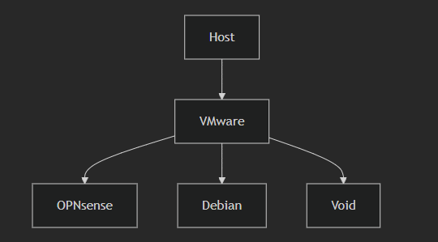

# Nastavení VMware

Rozhodl jsem se že simulace budu provádět v VMware virutalizačním softwaru. I přes to že se jedná o virtualizaci nad windows, podpora VMware s linuxovými systémi se mi zamlouvá víc než Hyper-V.

Nastavil jsem 3 vmware sítě:

- Lokální síť

- Síť NAT

- Síť host-vm

Taky jsem pro začátek rozjel virtualizační mašiny:

- Debian server

- OPNsense firewall server

- Void linux (client)

Proč zrovna Void linux jako client? Běžím na nich už nějakou dobu a jejich rychlost je nepřekonatelná (obzvlášť do VM).

> Chvíli jsem tedy bojoval s open-vm-tools na voidu, ale nakonec se vše podařilo

### Mapa VM

### Mapa sítě

OPNsense funguje jako firewall a je zároveň tedy komponent, který rozděluje lokální síť (LAN). Na LAN hostuje DHCP server. 

